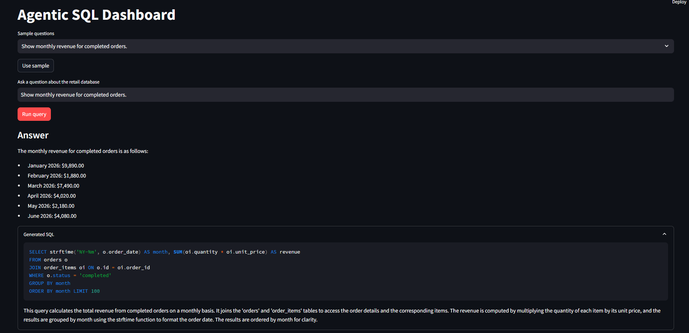
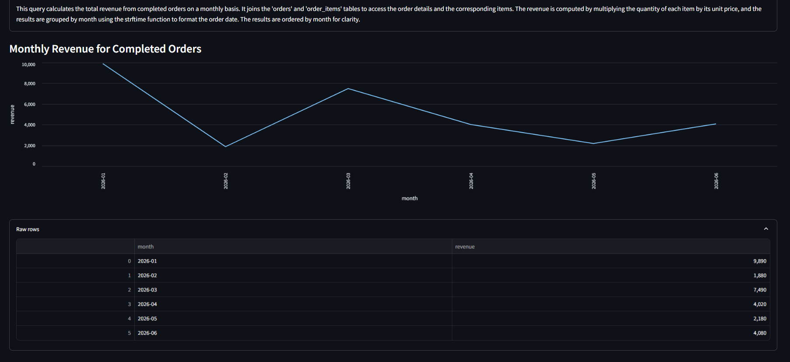
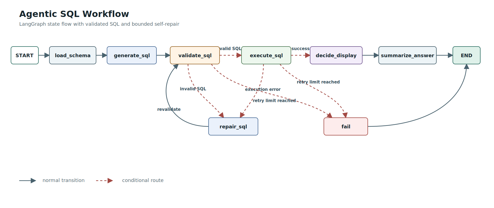

# Agentic SQL Dashboard

A self-contained LangGraph project that turns a natural-language business
question into SQL, executes it safely on a retail database, and returns both an
answer and a dashboard view that fits the actual result.

The project is intentionally compact. Its purpose is to make each agent node,
state transition, safety boundary, and architectural trade-off easy to inspect
and explain.

## What It Demonstrates

- Natural-language question to structured SQL.
- Schema-grounded refusal for questions the retail database cannot answer.
- Schema-aware SQL generation and bounded SQL repair.
- Read-only SQLite query execution.
- A dynamic primary dashboard element: KPI, line chart, bar chart, or table.
- Clear user feedback for validation, SQL execution, and service errors.
- Focused automated tests without live LLM calls.

## Stack

- Backend: FastAPI
- Agent workflow: LangGraph
- Database: SQLite
- Frontend: Streamlit
- LLM gateway: OpenRouter through langchain-openai
- Model: openai/gpt-4o-mini-2024-07-18

OpenRouter exposes an OpenAI-compatible API. The project therefore keeps the
standard ChatOpenAI client and isolates the provider key, base URL, and model
configuration in backend/llm.py.

## Setup

Create a virtual environment and install dependencies.

### Windows PowerShell

~~~powershell
python -m venv .venv
.\.venv\Scripts\Activate.ps1
python -m pip install -r requirements.txt
Copy-Item .env.example .env
~~~

### macOS or Linux

~~~bash
python -m venv .venv
source .venv/bin/activate
python -m pip install -r requirements.txt
cp .env.example .env
~~~

Set OPENROUTER_API_KEY in .env, then create the seeded retail database:

~~~powershell
.\.venv\Scripts\python.exe data\seed.py
~~~

## Run The Demo

Start the API:

~~~powershell
.\.venv\Scripts\python.exe -m uvicorn backend.main:app --reload
~~~

In a second terminal, start the dashboard:

~~~powershell
.\.venv\Scripts\streamlit.exe run frontend\app.py
~~~

Open http://127.0.0.1:8501. The health check is available at
http://127.0.0.1:8000/health.

## Assignment Coverage

| Assignment requirement | Implementation |
| --- | --- |
| Receive natural-language queries | Streamlit collects the question and sends it to the FastAPI query endpoint. |
| Convert queries into SQL | The LLM returns structured SQL, an explanation, and a display hint. |
| Execute database queries | Validated SELECT SQL runs against a seeded SQLite database opened read-only. |
| Deliver results to the user | FastAPI returns answer, SQL, rows, columns, display metadata, and error details. |
| Dynamically adjust dashboard elements | The backend returns KPI, line, bar, or table metadata from the actual result shape. |
| Error handling and feedback | Out-of-scope questions stop before SQL; invalid SQL and database errors enter bounded repair; provider failures return clear API errors. |
| Clean, intentional code | Modules separate graph orchestration, database access, validation, display policy, API, and UI. |
| Workflow and decisions documentation | This README, the workflow diagram, and architecture comments document the decisions. |

## Sample Questions

| Question | Expected display |
| --- | --- |
| What is the total revenue for completed orders? | KPI |
| Show monthly revenue for completed orders. | Line chart |
| What are the top 5 products by revenue? | Bar chart |
| List each product with its category and price. | Table |

These display types are not hardcoded to the questions. The decide_display
function checks returned columns and rows, and only accepts an LLM display hint
when it fits the real result shape.

## Worked Demo Example

Question:

~~~text
Show monthly revenue for completed orders.
~~~

The result is a month column plus a numeric revenue column. The agent therefore
returns a line-chart display specification after execution. The generated SQL is
visible in the dashboard for transparency and debugging.

## Agent Workflow

The workflow diagram source is kept in docs/agent-workflow.mmd alongside the
implementation in backend/graph.py.

1. Load current schema context.
2. Decide whether the question is answerable from the available schema.
3. Return a clear answer without SQL when the required data is unavailable.
4. Generate and validate SQL only for answerable questions.
5. Execute valid SQL through a read-only connection.
6. Decide the display from actual result rows, then summarize the result.

Validation and execution errors have distinct causes but share one bounded
recovery policy. When repair_sql produces replacement SQL, it returns to
validate_sql, not directly to execute_sql. Repaired SQL is still new LLM output
and must cross the same safety boundary as the initial query.

The graph stops after MAX_REPAIR_ATTEMPTS = 2, so a bad query cannot create an
unbounded repair loop or unlimited model cost.

Questions outside the retail schema are not treated as SQL errors. Retrying
cannot create data that does not exist, so the graph ends with a clear response
before validation or database execution.

## Error Handling And User Feedback

- Invalid or unsafe SQL is stored as graph state and can be repaired twice.
- Database planning or execution errors follow the same repair route.
- Questions outside the available retail schema return a clear answer and never
  execute SQL.
- After the retry limit, the graph returns a controlled failure message.
- OpenRouter or configuration failures have no SQL to repair, so FastAPI returns
  a clear service-level error at the API boundary.
- An empty dashboard result is shown as user feedback rather than a broken chart.

## Project Structure

- backend/state.py: shared graph fields and the repair limit.
- backend/graph.py: nodes, conditional routes, and state transitions.
- backend/llm.py: OpenRouter model setup and structured LLM calls.
- backend/prompts.py: generation, repair, and summary instructions.
- backend/validators.py: SELECT-only validation and response row limit.
- backend/db.py: schema loading and read-only SQL execution.
- backend/display.py: verifies the LLM display hint against actual rows.
- backend/main.py: FastAPI endpoints and service-level error handling.
- frontend/app.py: minimal Streamlit dashboard.
- data/seed.py: creates the retail demo database.
- tests/: validator, display, and graph-routing tests.
- docs/agent-workflow.svg: workflow visual used above.
- docs/images/: dashboard screenshots used in the worked example.

## Tests

~~~powershell
.\.venv\Scripts\python.exe -m pytest
~~~

The test suite covers SQL validation, schema-scope rejection, result-shape
display rules, the graph happy path, and the SQL repair route without making
real LLM calls.
